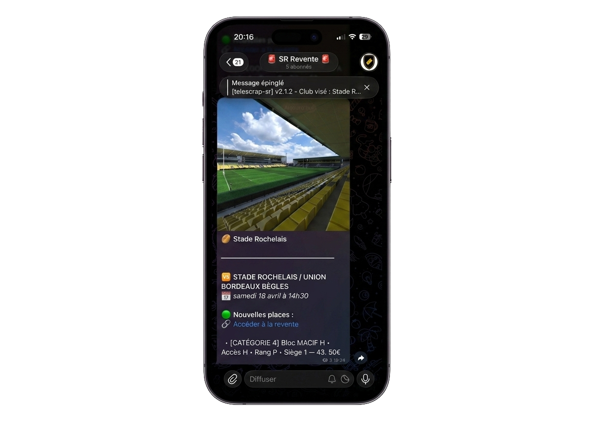

# telescrap-sr
 

	

Scraping tool to get notification for resale ticket, currently implemented for Stade Rochelais rugby matches.

## Roadmap

- [ ] Filter rework to allow 1 passive and mulitple aggressive filters
- [x] Admin panel to manage the bot (web interface or terminal)
- [ ] config.json to set up the scan and filter configuration by default (and save updated ones from the admin panel).

## Why this project ?

This is a project born from a simple observation. The number of people subscribed to well known rugby clubs is constantly increasing and prevents in its current state any new person who does not follow the matches closely from being able to access tickets. Fortunately, there is a resale platform, which is however itself saturated.

By creating this bot, I wanted to give everyone the opportunity to access tickets for the matches of their favorite club, even if they are not subscribed to the club's news or do not have the time to check the resale platform regularly.

The current ticket resale platforms are not designed to be easily accessible to everyone, and often require a lot of time and effort to find the right tickets. By automating this process, I hope to make it easier for everyone to access tickets for their favorite matches.

## How does it work?

The bot analyzes the homepage of the ticketing site, looking for the matches that are currently resaling tickets. When it finds a match, it checks if the tickets are available for resale and if they are, it sends a notification to the Telegram channel with the details of the match and the price of the tickets.

## Configuration

To set up the bot, follow the steps describes in [SERVER_INSTALLATION.md](doc/SERVER_INSTALLATION.md) documentation.

## 🚨 Telegram Resale Channel 🚨

The bot is currently active on a private resale channel, accessible only by manual addition.
You can request access by contacting the project administrator via private message.

<picture>
  <source media="(prefers-color-scheme: dark)" srcset="doc/img/telegram_channel.png">
  <source media="(prefers-color-scheme: light)" srcset="doc/img/telegram_channel.png">
  
</picture>

## Github Workflow

Current Github workflow (`deploy.yml`) is configured to automatically build and deploy the bot on a server when a new release is published.
## See also

- [ARCHITECTURE.md](doc/ARCHITECTURE.md) : for more details about the architecture of the project and the crates organization.
- [CHANGELOG.md](CHANGELOG.md) : for a detailed list of changes and updates made to the project over time.